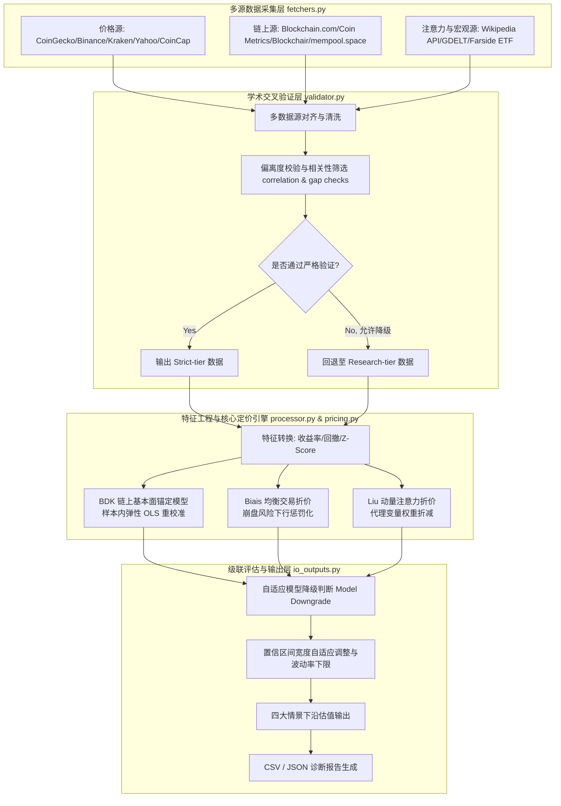

# 比特币多维动态定价与级联估值框架

本项目提供了一个基于金融学术理论的**比特币（BTC）统一多维动态下沿估值模型**。模型融合了链上核心基本面锚定与市场行为折价机制，能够在高波动或极端市场行情下，为比特币计算出具有坚实基本面支撑且经过市场情绪与交易摩擦调整的**绝对价格下限（Strict Lower Point / Bound）**。

模型基于三篇顶级金融学与经济学学术论文构建核心定价算法：
1. **Bhambhwani, Delikouras, and Korniotis (2019, BDK)** — 链上基本面与网络价值锚定
2. **Biais et al. (2023)** — 均衡交易便利收益与成本折价层
3. **Liu and Tsyvinski (2021)** — 动量与投资者注意力风险收益折价层

---

## 1. 级联定价体系 (Cascade Pricing System)

本模型采用**“基本面价值锚 + 双重行为折价”**的级联定价结构。首先通过比特币的底层生产力与网络效应确立基本面估值底座，再利用网络交易状态与市场情绪动量进行惩罚性折价，最终输出包含置信区间的下沿价格范围。

### 1.1 级联定价公式
$$\text{Strict Lower Point} = \text{BDK Stress Anchor} \times \text{Biais Discount} \times \text{Liu-Tsyvinski Discount}$$

$$\text{Valuation Range} = \text{Strict Lower Point} \times (1 \pm \text{Band Width})$$

### 1.2 系统工作流与数据级联


---

## 2. 核心定价算法与学术源起

### 2.1 BDK 链上基本面价值锚
基于 Bhambhwani et al. (2019) 论文，通过**算力（Hashrate）**与**网络规模（Active Addresses）**来衡量比特币作为数字资产的生产力与网络效应。

1. **长期 Log-Log 公允估值模型**：
   $$\log(P) = \alpha + \beta_{\text{hr}}\log(\text{HR}) + \beta_{\text{net}}\log(\text{AA}) + \epsilon$$
   * **动态样本内重校准（Recalibration）**：为解决比特币在不同历史周期（如机构化、ETF 引入后）基本面弹性的结构性漂移，模型支持在当前验证样本内自动进行 OLS 二元回归。当估计出的两项弹性系数均为正值时，将动态采用最新的样本内弹性，否则回退至经典历史弹性（$\beta_{\text{hr}} = 1.298$, $\beta_{\text{net}} = 1.802$）。截距项 $\alpha$ 一律使用 OLS 均值残差计算，确保估计的一致性。

2. **基本面压力锚定公式**：
   $$V_{\text{BDK}} = P_{\text{current}} \times \left(\frac{\text{HR}_{\text{stress}}}{\text{HR}_{\text{current}}}\right)^{\beta_{\text{hr\_used}}} \times \left(\frac{\text{AA}_{\text{stress}}}{\text{AA}_{\text{current}}}\right)^{\beta_{\text{net\_used}}}$$
   在设定的链上收缩压力情景下，计算比特币对应的基本面价值底座。

> [!IMPORTANT]
> 为避免指标重复计算导致过度折价，模型在后两篇论文的行为折价层中**禁用了 Active Addresses**，将其作为 BDK 网络效应的专有代理变量。

---

### 2.2 Biais 均衡交易折价算法
基于 Biais et al. (2023) 关于比特币均衡便利收益（Convenience Yield）与交易摩擦的实证，通过计算四个因子维度的滚动 $Z$-Score 并进行动态加权，生成 $S_{\text{Biais}}$ 综合评分：

$$S_{\text{Biais}} = w_1 \cdot Z_{\text{Benefit}} + w_2 \cdot Z_{\text{Cost}} + w_3 \cdot Z_{\text{Access}} + w_4 \cdot Z_{\text{Crash\_Risk}}$$

* **各维度代理指标与物理含义**：
  * **交易收益 (Benefit, 权重 40%)**：链上交易笔数与转账金额的均值，反映网络实际使用效用与价值流转能力。
  * **交易成本 (Cost, 权重 20%)**：链上平均手续费（取负值），代表网络拥堵带来的摩擦阻力。同时结合转账量大小进行复合评估，防止低活跃度状态被误读为利好。
  * **市场渠道 (Access, 权重 20%)**：比特币现货 ETF 资金净流入量，体现传统合规资本的准入通道度与流动性支持。
  * **崩盘风险 (Crash Risk, 权重 20%)**：滚动实现波动率与最大回撤的加权负 $Z$-Score。为防止牛市高位无回撤时扭曲整体评分，该组分经过 `clip(upper=0.0)` 处理，使其仅作为下行惩罚项而非溢价奖励项。

---

### 2.3 Liu-Tsyvinski 动量与注意力折价算法
基于 Liu and Tsyvinski (2021) 关于动量因子与投资者注意力对加密资产定价的预测效应，生成 $S_{\text{Liu}}$ 评分：

$$S_{\text{Liu}} = w_1' \cdot Z_{\text{Momentum}} + w_2' \cdot Z_{\text{Attention}} + w_3' \cdot Z_{\text{Neg\_Attention}} + w_4' \cdot Z_{\text{Activity\_Growth}}$$

* **各维度代理指标与物理含义**：
  * **市场动量 (Momentum, 权重 40%)**：7D / 14D / 28D 比特币对数收益率的均值，刻画短期价格惯性与趋势反转压力。
  * **普通注意力 (Attention, 权重 25%)**：维基百科页面浏览量等关注度指标的滚动 $Z$-Score。为对冲单一数据源的偏差，若指标未通过双源严格交叉验证，模型会将其标记为 `Research-tier` 级别代理，并对该维度权重乘以折减因子 `research_tier_weight_factor = 0.60`，以降低其置信度权重。
  * **负面注意力 (Neg Attention, 权重 20%)**：比特币负向词条（如 bubble、scalability）浏览占比（取负值），反映市场对负面事件的警惕度。作为 `Research-tier` 数据时，权重同样按 0.60 折减。
  * **活跃增长 (Activity Growth, 权重 15%)**：链上交易笔数的 7D 变化率，反映网络活力的增长势头。

---

### 2.4 折价函数与平滑映射
模型提供了两种可选的折价映射方式（可在配置中指定 `discount_method`）：
1. **连续指数折价（`exponential_downside`，默认）**：
   $$\text{Discount} = \max\left(\text{Floor}, \exp\left(\lambda \times \min(S, 0)\right)\right)$$
   仅在分数为负（即指标恶化）时触发连续平滑的下行折价，避免了传统阶梯阈值在临界点处的跳跃，能够更合理地模拟市场价值的平滑过渡。
2. **阶梯阈值折价（`threshold`）**：
   根据得分区间进行分段映射，给出固定的分档折扣（例如 $S < -0.5$ 映射为 `0.92` 折扣）。

---

## 3. 自适应状态评估与宽度调整机制

模型根据数据源的验证状态与样本充足度，设计了**状态自适应评估**与**置信区间自适应调整**机制：

1. **学术语义状态（Model Status）**：
   系统根据实际入模的数据质量，自动对模型状态进行归类，并赋予相应的基准区间宽度（`band_width`）：
   * `Full Model`：三大理论模块均通过严格多源验证（基准宽度：$0.05$）。
   * `BDK + Biais Core + Liu Attention Enhanced`：注意力指标增强的混合模型（基准宽度：$0.10$）。
   * `BDK + Biais Core + Liu Momentum` / `BDK + Liu Full`：包含部分折价或经典动量模块（基准宽度：$0.10 \sim 0.12$）。
   * `BDK + Biais Core` / `BDK + Liu Attention Enhanced` / `BDK + Liu Momentum`：单折价层模型（基准宽度：$0.15$）。
   * `BDK Only`：仅保留链上基本面锚，扩展折价层由于数据校验缺失未激活（基准宽度：$0.18$）。

2. **样本缺失宽度惩罚**：
   为防止计算窗口内有效样本不足导致定价精度失准，若核心验证指标天数偏低，将自动对区间宽度进行追加：
   * $\text{min\_core\_validated\_obs} < 60 \text{天}$：区间宽度追加 $+0.05$
   * $60 \text{天} \le \text{min\_core\_validated\_obs} < 90 \text{天}$：区间宽度追加 $+0.03$

3. **区间波动率下限（Band Width Floor）**：
   鉴于比特币高波动资产的特性，为避免估值区间过窄而造成脱离现实的精度错觉，模型设定了硬性波动率下限 `band_width_floor = 0.12`。最终的估值区间宽度将被限制在该下限与 $0.30$ 之间。

---

## 4. 压力情景体系设计

模型基于链上算力与活跃地址的历史分布，设计了四类不同强度的左侧压力测试情景：

| 情景名称 (Scenario) | 算力与活跃地址压力设定 | 物理含义与出模设定 |
| :--- | :--- | :--- |
| **基础压力 (Base)** | 降至最近样本的 30% 分位数，且不高于当前值的 98% | 模拟常规熊市底部的链上活跃度与算力收缩状态 |
| **核心下沿 (Core)** | 降至最近样本的 15% 分位数，且不高于当前值的 95% | **模型推荐的常规左侧建仓下沿参考** |
| **严重压力 (Severe)** | 降至最近样本的 5% 分位数，且不高于当前值的 90% | 对应行业发生重大系统性危机时的深度收缩状态 |
| **极端尾部 (Extreme)** | 降至最近样本的 5% 分位数，且不高于当前值的 85% | 模拟极端恐慌砸盘与行业黑天鹅底部的价格极限支撑 |

---

## 5. 项目模块与目录结构

* `btc_unified_pricing_model/`
  * `config.py`：模型核心参数配置，定义弹性参数、滑动窗口大小及 Z-Score 参数。
  * `config_loader.py`：负责载入本地 JSON/YAML 配置并进行参数覆盖。
  * `fetchers.py`：多源数据采集引擎。集成各类公开免费 API，实现多副本自动备用切换。
  * `validator.py`：数据清洗与学术级交叉验证层。过滤未经验证的异动脏数据，进行相关性与偏离度校验。
  * `processor.py`：特征工程模块。将采集数据对齐，并计算滚动收益率、回撤、波动率以及滚动 $Z$-Score。
  * `pricing.py`：核心定价引擎。实现 BDK 样本内回归、折价计算与四类压力情景级联运算。
  * `health.py`：数据源请求健康追踪器。
  * `io_outputs.py`：输出格式化转换器，生成诊断 JSON 和 CSV 结果表。
  * `pipeline.py` / `cli.py`：模型生命周期流水线串联与 CLI 接口。
* `tests/`：单元测试。
* `example_outputs/`：存放示例运行结果（如 [btc_three_paper_framework_pricing_v1_3.csv](file:///c:/Users/78432/OneDrive/桌面/QuantStrat/Crypto_Pricing—— 加密货币定价/example_outputs/btc_three_paper_framework_pricing_v1_3.csv)）。

---

## 6. 使用与运行指南

### 6.1 环境准备
安装 Python 3.9+ 并在根目录下安装依赖包：
```bash
pip install -r requirements.txt
```

### 6.2 快速运行
使用默认流水线运行模型并生成估值数据：
```bash
python btc_unified_pricing_model_v1_3.py --days 180 --output-dir ./btc_pricing_output_v1_3
```

### 6.3 命令行常用参数
* `--config`: 指定外部 JSON/YAML 配置文件路径。
* `--days`: 设定历史对齐与计算的时间窗口天数（默认 180 天）。
* `--skip-gdelt`: 跳过爬取 GDELT 负面新闻，能够显著加快没有缓存时的计算时间。
* `--skip-etf`: 跳过爬取 ETF 资金流向数据。
* `--fast`: 快速诊断模式（自动跳过 GDELT 和 ETF 数据爬取，缩短网络连接超时，适用于快速测试）。

### 6.4 配置文件示例 (`config.json`)
可使用外部配置文件进行精细化参数定义：
```json
{
  "days": 180,
  "output_dir": "./btc_pricing_output_v1_3",
  "beta_recalibrate_in_sample": true,
  "discount_method": "exponential_downside",
  "band_width_floor": 0.12,
  "research_tier_weight_factor": 0.60
}
```
